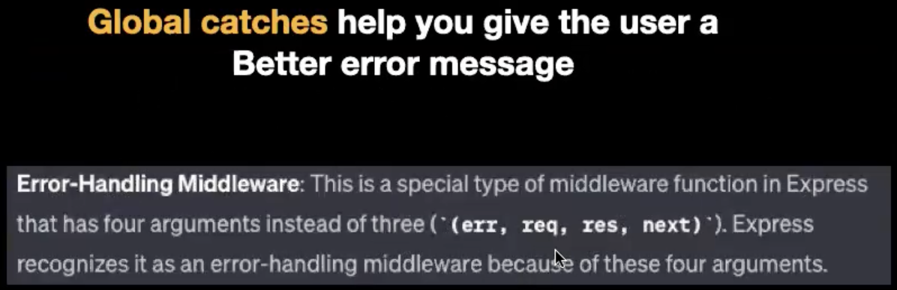

### why do we need input validation?
- to ensure that the data we are receiving is in the correct format
- to ensure that the data we are receiving is not malicious
- to ensure that the data we are receiving is not too large

Code below is an example of a simple express server that takes in a json object and returns the number of kidneys in the object as a response.

but the problem with this code is that it does not validate the input. If the input is not in the correct format, the server will crash.
    
```javascript
const express = require('express');

const app = express();

app.use(express.json());

app.post('/health-check', (req, res) => {
    const kidneys = req.body.kidneys;
    const kidneyLen = kidneys.length;

    res.send(`You have `+ kidneyLen + ` kidneys`);
})

app.listen(3000)
```

### global catch
- a global catch is a middleware that catches all errors that are thrown in the application
- it is useful for catching errors that are not caught by the individual route handlers

```javascript
const express = require('express');

const app = express();

app.use(express.json());

app.post('/health-check', (req, res) => {
    const kidneys = req.body.kidneys;
    const kidneyLen = kidneys.length;

    res.send(`You have `+ kidneyLen + ` kidneys`);
})

# global catch
app.use((err, req, res, next) => {
    res.status(500).send(`Can't process that`);
})

app.listen(3000)
```

